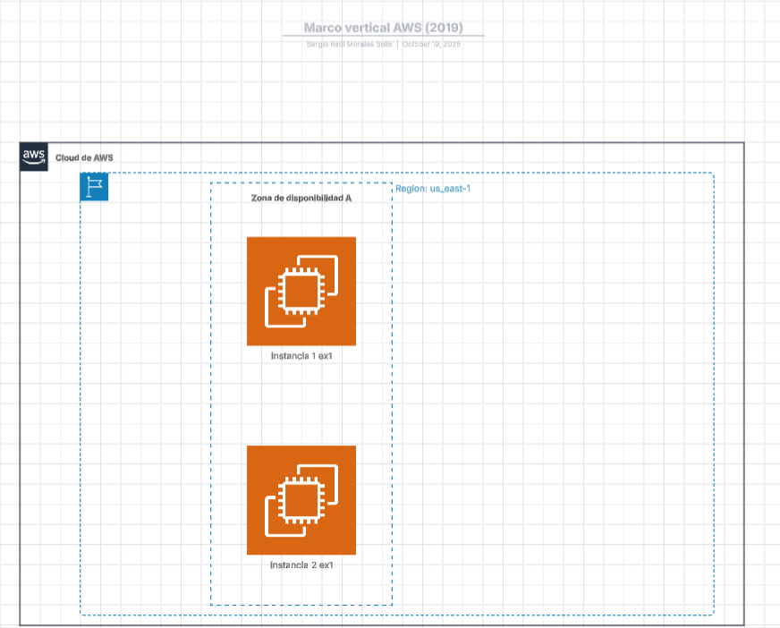

# Explicación del ejercicio
En este ejercicio creamos una serie de carpetas y archivos.
Y entre estos archivos esta el "main.tf"  que lo usamos para crear 2 maquinas en AWS

# Ecplicación de la topoligia 
Como vemos en la imagen esta todo dentro del porveedor de cloud de AWS y usamos la region de "us-east-1" y dentro de este estan las 2 maquinas de ubuntu 

