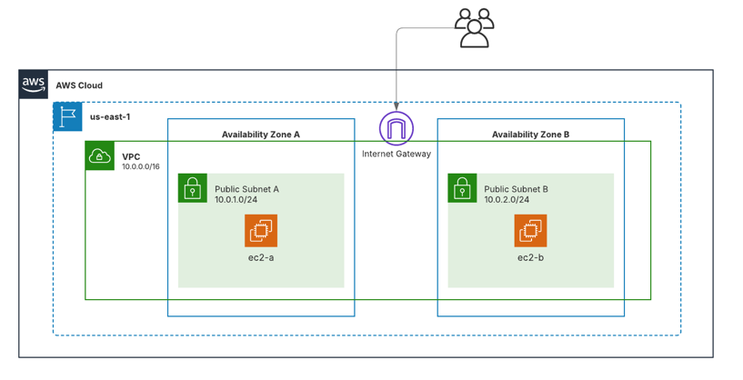

# Explicación del ejercicio
En este ejercicio teniamos que crear una VPC, subredes, internet gateway, tablas de direccionamiento, grupos de seguridad y por ultimo 2 intancias 1 en cada subred

# Aqui dejo una imagen de la topologia 

